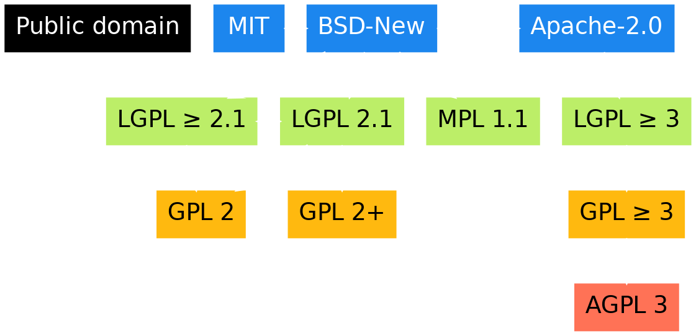
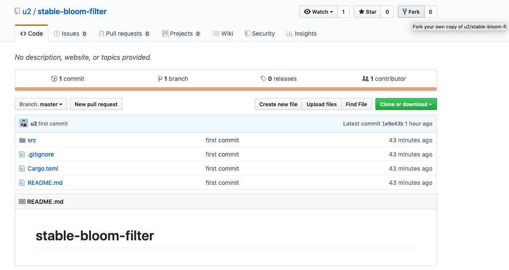
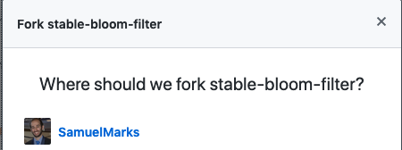
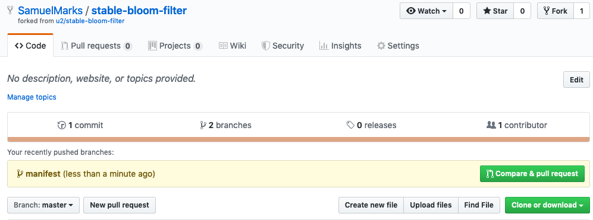
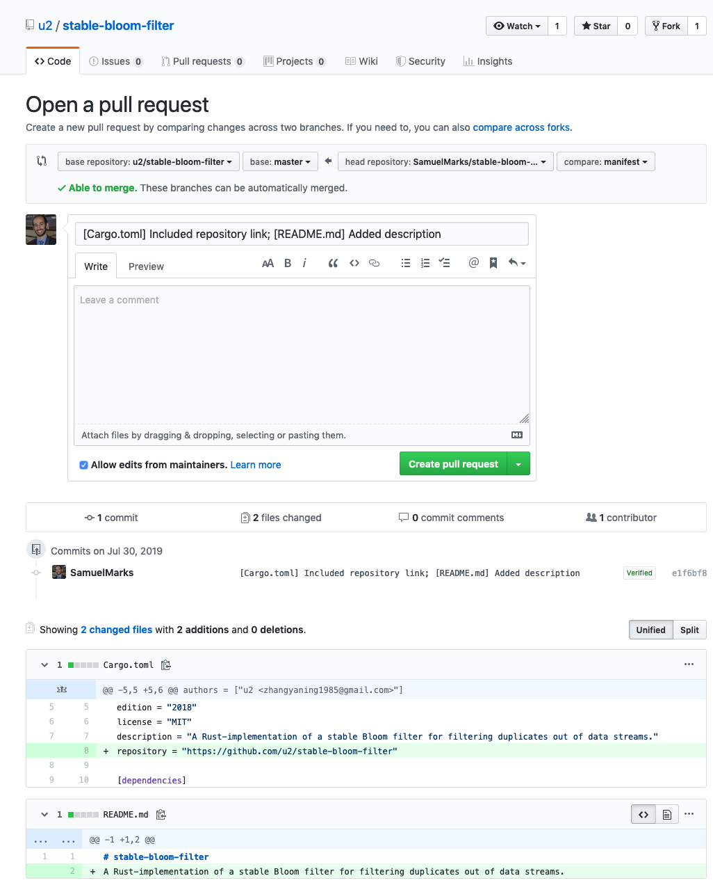
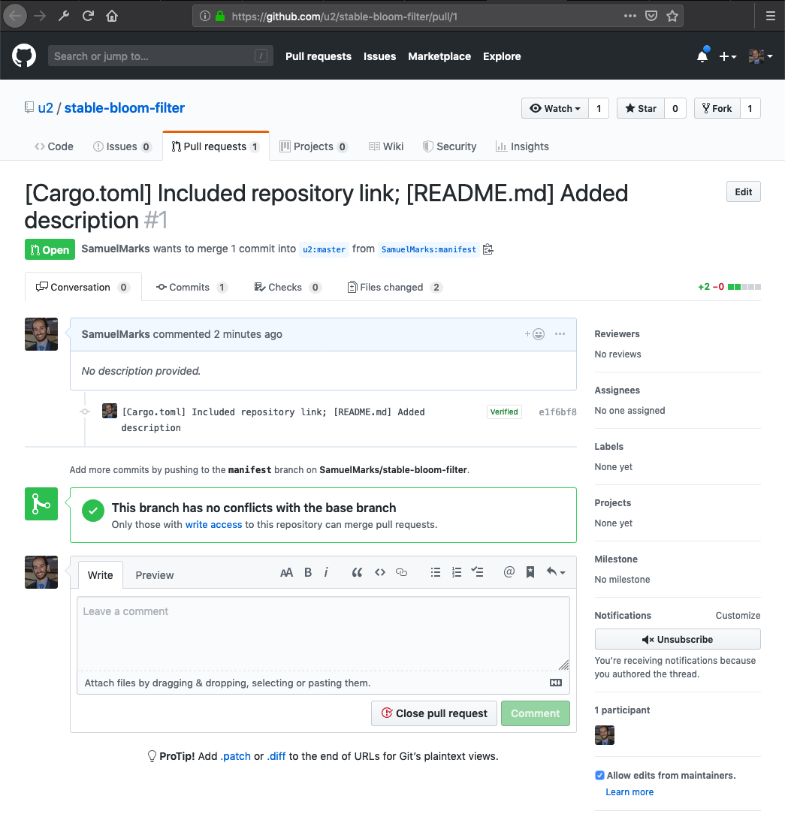
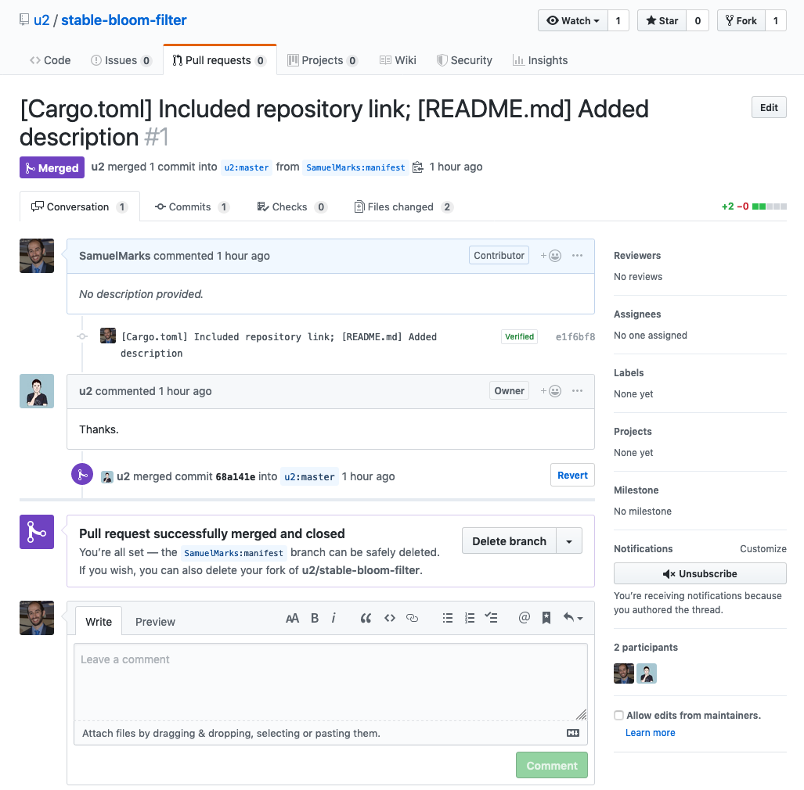
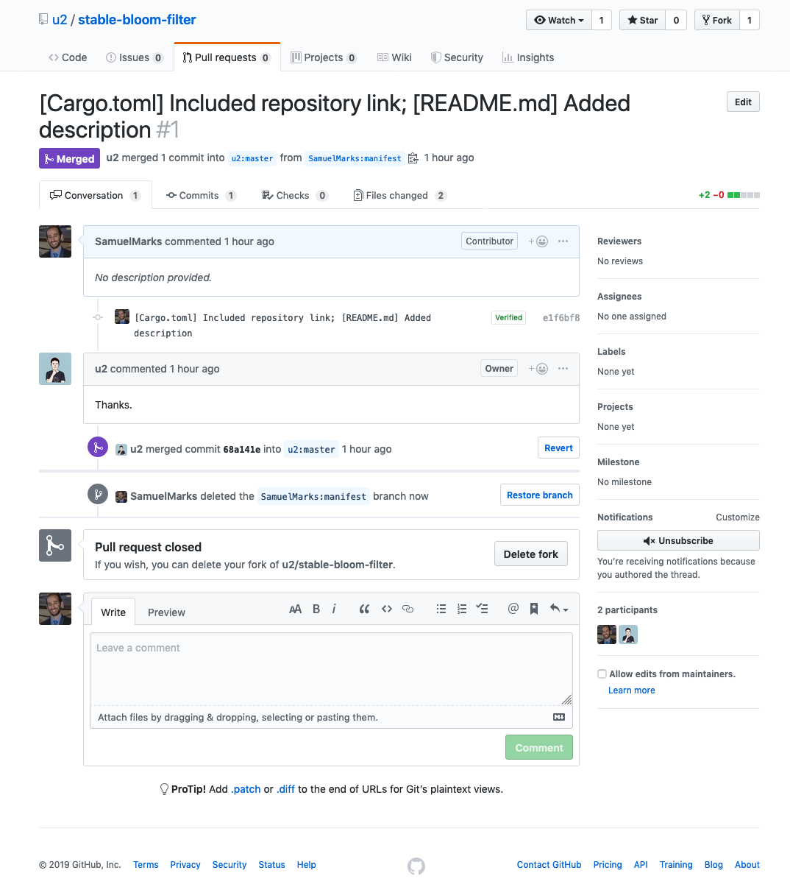

---
presentation:
  width: 800
  height: 600
  theme: moon.css
---

<!-- slide -->
# Open-source
Who, what, why, where, how

---

_or how I learned to stop hiding; and expose the bomb_

<!-- slide -->
This slide-deck: https://offscale.io/cse-07-19.html

<!-- slide -->
# Who am I

<!-- slide -->
# What
Open-source means freedom.

Freedom to share code, usually commercially and privately.

<!-- slide -->
# Licenses


<!-- slide -->
# Why
- Development speed
- Quality (tests; security; ~~documentation~~)
- Interoperability
- Community
- Learning

<!-- slide -->
# Where: Charity

<!-- slide -->
# Where: Gov't
- Auditability & accountability

<!-- slide -->
# Where: Business

## 2018
- Mesosphere raised \$125M (\$247M to date)
- Hashicorp raised \$100M (\$174.2M to date)
- CoreOS bought for \$250M by Red Hat
- Red Hat bought for \$34B by IBM

<!-- slide -->
# How: new project

  0. Pick a license;
  1. Pick a name;
  2. Create a repository;
  3. Upload repository (e.g.: to GitHub)

<!-- slide -->
# How: existing projects

  0. Pick a project;
  1. Pull it to local computer [usually];
  2. Make modifications;
  3. Send back modifications
  <!-- as: patch, pull-request, or whatever the project change-management policy is -->

<!-- slide -->
# How: for n00bs
New to programming, or a nonprogrammer?

No matter. Plenty of low-hanging fruit; _even_ for you!

(see appendix for details)

<!-- slide -->
github.com/SamuelMarks
github.com/offscale
samuel@offscale.io
/in/samuelmarks

<!-- slide -->
Appendix
--------

<!-- slide -->
# Low-hanging

  - README.md cleanup
  (the first document the public views);
  - Spell checking;
  - Linting (semicolons, tabs vs. spaces, &etc.);
  - Badges/shields, like:
  [](https://opensource.org/licenses/Apache-2.0) [](https://travis-ci.org/SamuelMarks/restify-orm-scaffold) [](https://coveralls.io/github/SamuelMarks/restify-orm-scaffold) 

<!-- slide -->
# Low-hanging

  - Code quality metrics (automated, e.g.: with CI/CD integration)
    - Code coverage
    - Test coverage
  - Dotfiles: adding these to the root of the repository increases quality:
    - `.gitignore`; `.editorconfig`

<!-- slide -->
# Low-hanging

  - Compliance (e.g.: PEP8 in Python; strict-mode in ECMAScript)
  - Writing simple tests

<!-- slide -->
# Medium-hanging

  - Writing tests
  - Static code analysis with tooling, e.g.: what opening a project with a JetBrains IDE, selecting "Code"->"Inspect Code..." from the menu bar will expose

<!-- slide -->
# Medium-hanging

  - CI/CD integration (Azure Pipelines; Travis CI; Appveyor and/or CircleCI)
    - See next slide

<!-- slide -->
```yml
# Filename: .travis.yml
language: node_js
node_js:
    - "lts/*"
cache:
    npm: true
before_install:
    - npm install -g npm
install:
    - npm ci
script:
    - tsc
    - npm test
after_success:
    - npm run coverage
```

<!-- slide -->
# Medium-hang

  - Interoperability, e.g.:
    - OS support for: Windows, Linux, macOS, FreeBSD
    - Language support for: Python 2 & 3 [not as relevant anymore!]; newer/older JS
    - Package support for application-level dependency managers, e.g.:
      - Python: `setup.py`; Node.js: `package.json`; Rust: `Cargo.toml`

<!-- slide -->
# Medium-hanging fruit

  - Docker integration
    - See next slide

<!-- slide -->
```docker
# Filename: Dockerfile

# Use Node.js' long-term support release
FROM node:lts-alpine

# Copy source code
COPY . /app

# Change working directory
WORKDIR /app

# Install dependencies
RUN npm ci

# Expose API port to the outside
EXPOSE 80

ENTRYPOINT ["npm", "start"]
```

<!-- slide -->
# High-hanging

  - Bots to automate changes, from small things like updating dependencies, to large things like modifying a codebase through AST traversals
  - Major contributions to large codebases, e.g.: adding strict resource limits to FreeBSD jails by modifying the kernel

<!-- slide -->
Workshop
========

<!-- slide -->
# 0) Workshop: contribute

  0. Create an account on https://github.com
  1. Pick a project, e.g.: from https://github.com/explore

<!-- slide -->
#

<!-- slide -->
# 1) Make your own copy of the project

This is generally dubbed a _fork_.

>Most commonly, forks are used to either propose changes to someone else's project or to use someone else's project as a starting point for your own idea.
- https://help.github.com/en/articles/fork-a-repo

<!-- slide -->
#

<!-- slide -->
#

<!-- slide -->
# 2) Contribute

  0. Install `git`: https://git-scm.com/downloads
  1. Open your terminal / command prompt
  2. Run `git clone` followed by the URL of the repository, e.g.:
  ```sh
  git clone https://github.com/SamuelMarks/restify-orm-scaffold
  ```

<!-- slide -->
# 3) Contribute

  3. **Modify** (e.g.: using the CLI, an IDE, manually modifying using a GUI file manager)
  4. On the command-line, `cd` into the directory you `clone`d
  5. Run:
  ```sh
  git config --global user.name "FIRST_NAME LAST_NAME"
  git config --global user.email "NAME@example.com"
  ```

<!-- slide -->
# 4) Contribute

  6. Create a [feature branch](https://martinfowler.com/bliki/FeatureBranch.html) with:
  ```sh
  git checkout -b feature_name_goes_here
  ```
  7. See your modifications with:
  ```sh
  git status
  ```

<!-- slide -->
# 5) Contribute

  8. Add your modifications by specifying the relative filename for each modification you want:
  ```sh
  git add <filepath/filename> <filepath/filename>
  ```
  9. Commit your modifications with:
  ```sh
  git commit --message "Commit message goes here"
  ```

<!-- slide -->
# 6) Contribute

  10. Put your changes online, with:
  ```sh
  git push origin feature_name_goes_here
  ```
  11. Send PR—using [`hub`](https://hub.github.com) CLI—or online (see next slides)

<!-- slide -->
#

<!-- slide -->
#

<!-- slide -->
#

<!-- slide -->
#

<!-- slide -->
#

<!-- slide -->
*See first slide*

<!-- slide -->
# Your turn
0. Explore github for the open-source project you want to contribute to
1. Add a new issue to https://github.com/offscale/offscale-presentations specifying which project you're working on
2. Contribute ;)

<!-- slide -->
# Next steps

- Get free stuff: https://github.com/AchoArnold/discount-for-student-dev
- Continue contributing
- Profit

<!-- slide -->

This slide-deck: https://offscale.io/cse-07-19.html

github.com/SamuelMarks
github.com/offscale
samuel@offscale.io
/in/samuelmarks
